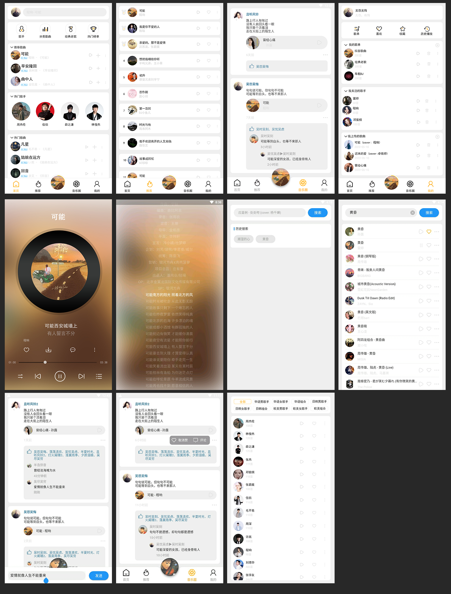

# springboot-app-service

使用springboot搭建的音乐，电影，书栈，视频教程，明日头条app的后台项目，所有数据来自互联网，使用python爬虫抓取，涉及，负载均衡，redis缓存，JwtToken权限验证，拦截器，日志记录，erauka服务治理，mybatis,spring-data-jpa,swagger等，持续更新中...   

================================APP界面预览================================   





================================APP界面预览================================   

================================sql实例===============================   


sql数据来自于python爬虫项目，自动爬取第三方电影网站，由于涉及到资源版权，爬虫项目暂未公开

接口和数据请在本地电脑中，暂时没有购买和部署服务器，仅限本地调试，如有需要调试请联系本人启动外网映射

本地调试请把 http://192.168.0.5:5001 改成 http://254a2y1767.qicp.vip    
该地址是映射到本人电脑的地址，需要本人电脑开机才能访问，一般在工作日晚上八点半之后或者周末白天会开机   
如需了解是否已开机，请用浏览器直接打开该地址：http://254a2y1767.qicp.vip，如出现以下提示，则正常使用   


本站所有视频和图片均来自互联网收集而来，版权归原创者所有，本网站只提供web页面服务，并不提供资源存储，也不参与录制、上传 若本站收录的节目无意侵犯了贵司版权，请联系

联系方式：（微信）wuwenqiang_99、（邮箱）275018723@qq.com

================================sql实例===============================   


================================手机UI项目================================   
flutter版本参见:   
github地址：https://github.com/wuyuanwuhui99/flutter-movie-app-ui   
gitee地址：https://hub.nuaa.cf/wuyuanwuhui99/flutter-movie-app-ui

flutter音乐项目参见:   
github地址：https://github.com/wuyuanwuhui99/flutter-music-app-ui   
gitee地址：https://hub.nuaa.cf/wuyuanwuhui99/flutter-music-app-ui

react native版本参见:   
github地址：https://github.com/wuyuanwuhui99/react-native-app-ui   

java安卓原生版本参见：  
通用地址：https://github.com/wuyuanwuhui99/android-java-movie-app-ui   
gitee地址：https://hub.nuaa.cf/wuyuanwuhui99/android-java-movie-app-ui

uniapp版本参见：
github地址：https://github.com/wuyuanwuhui99/uniapp-vite-vue3-ts-movie-app-ui   
gitee地址：https://gitee/wuyuanwuhui99/uniapp-vite-vue3-ts-movie-app-ui  

uniapp音乐项目参见：
github地址：https://github.com/wuyuanwuhui99/uniapp-vite-vue3-ts-music-app-ui   
gitee地址：https://gitee/wuyuanwuhui99/uniapp-vite-vue3-ts-music-app-ui  

微信小程序版本参见：  
通用地址：https://github.com/wuyuanwuhui99/weixin-movie-app-ui、  
国内镜像地址：https://hub.nuaa.cf/wuyuanwuhui99/weixin-movie-app-ui

harmony鸿蒙版本参见:   
github地址：https://github.com/wuyuanwuhui99/Harmony_movie_app_ui   
gitee地址：https://hub.nuaa.cf/wuyuanwuhui99/Harmony_movie_app_ui

harmony鸿蒙音乐项目参见:   
github地址：https://github.com/wuyuanwuhui99/harmony_music_app_ui   
gitee地址：https://hub.nuaa.cf/wuyuanwuhui99/harmony_music_app_ui

vue在线音乐项目：  
通用地址：https://github.com/wuyuanwuhui99/vue-music-app-ui   
国内镜像地址：https://hub.nuaa.cf/wuyuanwuhui99/vue-music-app-ui

在线音乐后端项目：  
通用地址：https://github.com/wuyuanwuhui99/koa2-music-app-service   
国内镜像地址：https://hub.nuaa.cf/wuyuanwuhui99/koa2-music-app-service

vue3+ts明日头条项目：  
通用地址：https://github.com/wuyuanwuhui99/vue3-ts-toutiao-app-ui  
国内镜像地址：https://hub.nuaa.cf/wuyuanwuhui99/vue3-ts-toutiao-app-ui   
================================手机UI项目================================   

play-user项目启动参数 -DSECRET=wuwenqiang -DMYSQL_PASSWORD=wwq_2021   
参数解析   
SECRET：密钥   
MYSQL_PASSWORD：数据库密码   

nginx(nginx.conf文件)配置如下   
```


#user  nobody;
worker_processes  1;

#error_log  logs/error.log;
#error_log  logs/error.log  notice;
#error_log  logs/error.log  info;

#pid        logs/nginx.pid;


events {
    worker_connections  1024;
}


http {
    include       mime.types;
    default_type  application/octet-stream;

    #log_format  main  '$remote_addr - $remote_user [$time_local] "$request" '
    #                  '$status $body_bytes_sent "$http_referer" '
    #                  '"$http_user_agent" "$http_x_forwarded_for"';

    #access_log  logs/access.log  main;

    sendfile        on;
    #tcp_nopush     on;

    #keepalive_timeout  0;
    keepalive_timeout  65;

    #gzip  on;

    server {
        listen       80;
        server_name  localhost;

        proxy_set_header X-Forwarded-Host $host;
		proxy_set_header X-Forwarded-Server $host;
		proxy_set_header X-Forwarded-For $proxy_add_x_forwarded_for;
		
		location / {
			proxy_pass http://127.0.0.1:9001;
			proxy_connect_timeout 600;
			proxy_read_timeout 600;
		}
    }

    upstream music_server{
        server 127.0.0.1:3000 weight=10;
        server 127.0.0.1:3001 weight=10;
    }

    server{
        listen       5001;
        location /service/movie/ {
            proxy_pass http://127.0.0.1:5000;
            client_max_body_size  1g;
        }
        location /service/movie-getway/ {
            proxy_pass http://127.0.0.1:5000;
            client_max_body_size  1g;
        }
        location /service/myMusic/ {
            proxy_pass http://127.0.0.1:4000;
            client_max_body_size  1g;
        }
        location /service/myMusic-getway/ {
            proxy_pass http://127.0.0.1:4000;
            client_max_body_size  1g;
        }
        location /service/music/ {
            proxy_pass http://127.0.0.1:4000;
            client_max_body_size  1g;
        }
        location /service/social/ {
            proxy_pass http://127.0.0.1:8002;
            client_max_body_size  1g;
        }
        location /service/social-getway/ {
            proxy_pass http://127.0.0.1:8002;
            client_max_body_size  1g;
        }
        location /service/circle/ {
            proxy_pass http://127.0.0.1:8003;
            client_max_body_size  1g;
        }
        location /service/circle-getway/ {
            proxy_pass http://127.0.0.1:8003;
            client_max_body_size  1g;
        }
        location /service/user/ {
            proxy_pass http://127.0.0.1:9000;
            client_max_body_size  1g;
        }
        location /service/user-getway/ {
            proxy_pass http://127.0.0.1:9000;
            client_max_body_size  1g;
        }
        location /static/ {
            alias G:/static/;
        }
    }


    server{
        listen       3002;
        #静态资源，包括系统所需要的图片，js、css等静态资源
        location / {
            alias F:/vue/vue-music-app-ui/dist/;
        }
        location /service/ {
            proxy_pass http://music_server;
            #proxy_pass http://127.0.0.1:3000;
        }
        location /static/ {
            alias G:/static/;
        }
        location /images/ {
            alias G:/static/music/images/;
        }
        location /audio/ {
            alias G:/static/music/audio/;
        }
    }

    server{
        listen       3003;
        location / {
            alias F:/vue/vue3-ts-movie-circle-app-ui/dist/;
        }
        location /service/ {
            proxy_pass http://127.0.0.1:8003;
        }
        location /static/ {
            alias G:/static/;
        }
    }


    # another virtual host using mix of IP-, name-, and port-based configuration
    #
    #server {
    #    listen       8000;
    #    listen       somename:8080;
    #    server_name  somename  alias  another.alias;

    #    location / {
    #        root   html;
    #        index  index.html index.htm;
    #    }
    #}


    # HTTPS server
    #
    #server {
    #    listen       443 ssl;
    #    server_name  localhost;

    #    ssl_certificate      cert.pem;
    #    ssl_certificate_key  cert.key;

    #    ssl_session_cache    shared:SSL:1m;
    #    ssl_session_timeout  5m;

    #    ssl_ciphers  HIGH:!aNULL:!MD5;
    #    ssl_prefer_server_ciphers  on;

    #    location / {
    #        root   html;
    #        index  index.html index.htm;
    #    }
    #}

}

   
```
