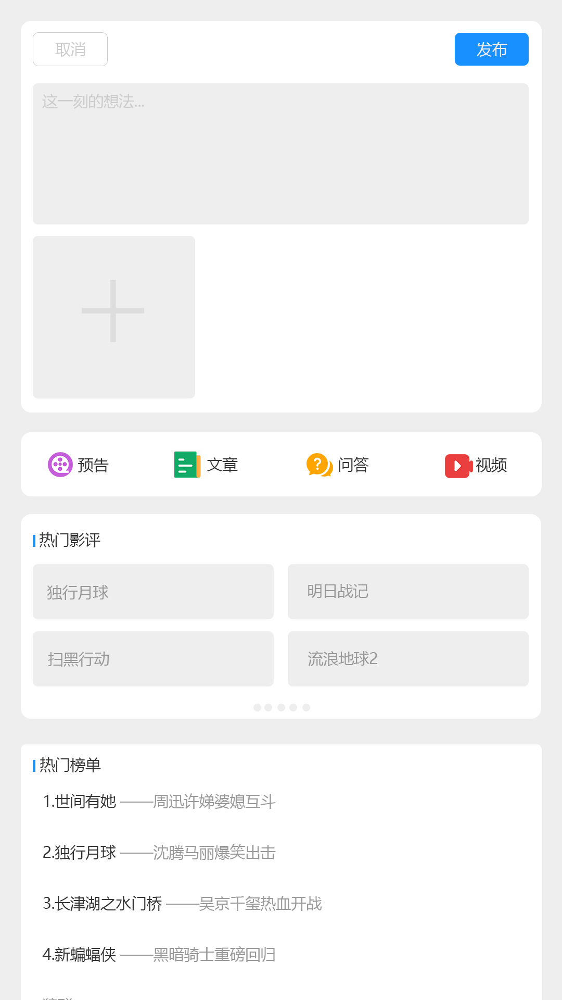

# springboot-app-service

使用springboot搭建的音乐，电影，书栈，视频教程，明日头条app的后台项目，所有数据来自互联网，使用python爬虫抓取，涉及，负载均衡，redis缓存，JwtToken权限验证，拦截器，日志记录，erauka服务治理，mybatis,spring-data-jpa,swagger等，持续更新中...   

================================APP界面预览================================   




================================APP界面预览================================   

================================sql实例===============================   


sql数据来自于python爬虫项目，自动爬取第三方电影网站，由于涉及到资源版权，爬虫项目暂未公开

接口和数据请在本地电脑中，暂时没有购买和部署服务器，仅限本地调试，如有需要调试请联系本人启动外网映射

本站所有视频和图片均来自互联网收集而来，版权归原创者所有，本网站只提供web页面服务，并不提供资源存储，也不参与录制、上传 若本站收录的节目无意侵犯了贵司版权，请联系

联系方式：（微信）wuwenqiang_99、（邮箱）275018723@qq.com

================================sql实例===============================   


================================手机UI项目================================   
flutter版本参见:   
通用地址：https://github.com/wuyuanwuhui99/flutter-movie-app-ui   
国内镜像地址：https://hub.nuaa.cf/wuyuanwuhui99/flutter-movie-app-ui

react native版本参见:   
通用地址：https://github.com/wuyuanwuhui99/react-native-app-ui   
国内镜像地址：https://hub.nuaa.cf/wuyuanwuhui99/react-native-app-ui

java安卓原生版本参见：  
通用地址：https://github.com/wuyuanwuhui99/android-java-movie-app-ui   
国内镜像地址：https://hub.nuaa.cf/wuyuanwuhui99/android-java-movie-app-ui

uniapp版本参见：
通用地址：https://github.com/wuyuanwuhui99/uniapp-vite-vue3-ts-movie-app-ui   
国内镜像地址：https://hub.nuaa.cf/wuyuanwuhui99/uniapp-vite-vue3-ts-movie-app-ui  

微信小程序版本参见：  
通用地址：https://github.com/wuyuanwuhui99/weixin-movie-app-ui、  
国内镜像地址：https://hub.nuaa.cf/wuyuanwuhui99/weixin-movie-app-ui

harmony鸿蒙版本参见:   
通用地址：https://github.com/wuyuanwuhui99/Harmony_movie_app_ui   
国内镜像地址：https://hub.nuaa.cf/wuyuanwuhui99/Harmony_movie_app_ui

vue在线音乐项目：  
通用地址：https://github.com/wuyuanwuhui99/vue-music-app-ui   
国内镜像地址：https://hub.nuaa.cf/wuyuanwuhui99/vue-music-app-ui

在线音乐后端项目：  
通用地址：https://github.com/wuyuanwuhui99/koa2-music-app-service   
国内镜像地址：https://hub.nuaa.cf/wuyuanwuhui99/koa2-music-app-service

vue3+ts明日头条项目：  
通用地址：https://github.com/wuyuanwuhui99/vue3-ts-toutiao-app-ui  
国内镜像地址：https://hub.nuaa.cf/wuyuanwuhui99/vue3-ts-toutiao-app-ui   
================================手机UI项目================================   

nginx配置如下   
```
server{   
    listen       5001;   
    location /service/movie/ {   
        proxy_pass http://127.0.0.1:5000;   
        client_max_body_size  1g;   
    }   
    location /service/movie-getway/ {   
        proxy_pass http://127.0.0.1:5000;   
        client_max_body_size  1g;   
    }   
    location /service/myMusic/ {   
        proxy_pass http://127.0.0.1:4000;   
        client_max_body_size  1g;   
    }   
    location /service/myMusic-getway/ {   
        proxy_pass http://127.0.0.1:4000;   
        client_max_body_size  1g;
    }
    location /service/music/ {   
        proxy_pass http://127.0.0.1:4000;   
        client_max_body_size  1g;   
    }   
    location /service/social/ {   
        proxy_pass http://127.0.0.1:8002;   
        client_max_body_size  1g;   
    }   
    location /service/circle/ {   
        proxy_pass http://127.0.0.1:8003;   
        client_max_body_size  1g;   
    }   
    location /service/user/ {   
        proxy_pass http://127.0.0.1:9000;   
        client_max_body_size  1g;   
    }
    location /static/ {   
        alias G:/static/;   
    }   
}   
```
